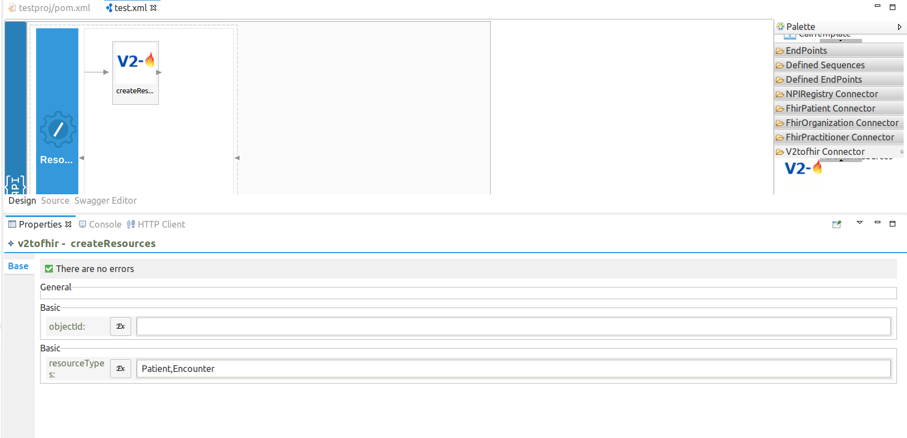

# Example

## Coverting HL7 message to FHIR

This example will guide you to convert an HL7 message to FHIR using WSO2 V2-To-FHIR datamapper.

## Prerequisites
1. You need to first download the [WSO2 Integration Studio](https://wso2.com/integration/integration-studio/) to develop FHIR Integrations.

2. Add the V2-To-FHIR datamapper by [importing](https://ei.docs.wso2.com/en/latest/micro-integrator/develop/creating-artifacts/adding-connectors/#importing-connectors) into Integration studio.

3. In order to recieve a HL7 message to the integration layer you have to configure [HL7 transport](https://ei.docs.wso2.com/en/7.2.0/micro-integrator/setup/transport_configurations/configuring-transports/#configuring-the-hl7-transport) and implement a [HL7 listener proxy](https://ei.docs.wso2.com/en/7.2.0/micro-integrator/use-cases/examples/hl7-examples/HL7_proxy_service/) in the integration flow.

## Configuring the datamapper

After adding the datamapper you will be able to see it in the palette. CreateResources operation is used to construct the required resources from a HL7 V2 message available within the message flow. You can drag and drop the CreateResources operation to the canvas in the Integration Studio and configure.

In the following example we have added Patient and Encounter resources to be created from the hl7 v2 message. For example, If the HL7 V2 message has PID segments and PV segments it will create Patient and encounter resources accordingly with the prebuild mappings and output the result as a bundle to the message context. You can provide the resources need to be created from the HL7 message by giving resource names in comma seperated manner.

