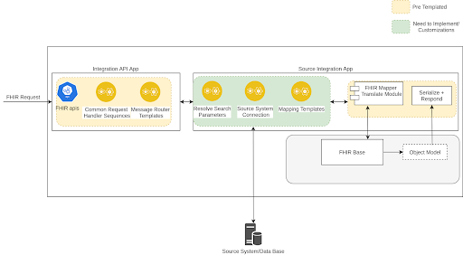

# Overview

WSO2 Open Healthcare facilitates to pre generate the integration projects based on the [FHIR Implementation Guides](https://wiki.hl7.org/FHIR_Implementation_Guides). 
Each implementation guide provides a set of profiles that are extended from FHIR resources and cover a certain use case. 

Main objective of grouping the artifacts into two projects is to offload the developer’s workload and give more space to
focus only on business logic related implementation. That is, in a regular FHIR implementation, the API Integration 
project can be built and deployed without any changes and all the source data related logic can be implemented in 
the Source Integration project.

### Contents of each project are as follows
- API Integration project
    - API artifacts
    - Common sequences - It holds the common operations such as creating bundles, error handling and etc. 
- Source Integration project
    - Profile Sequences - Per each profile, a dedicated sequence artifact is generated.
    - Common sequences - Some sequences are being used across multiple profiles.
    - Templates - For the places where repetitive integration logic is being executed, templates can be used. Each 
    artifact will contain certain guidelines as comments so that the integration developer can accelerate their work 
     while following the best practices.
